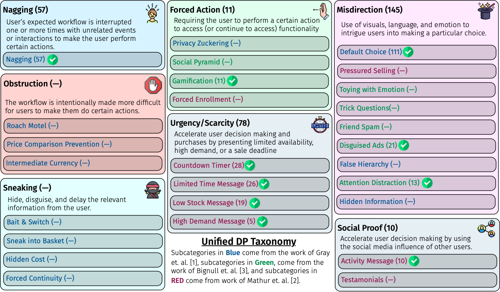

<h2 align="center"> AidUI: Toward Automated Recognition of Dark Patterns in User Interfaces </h2>

[](https://doi.org/10.5281/zenodo.7644966) [](https://opensource.org/licenses/Apache-2.0)

## Overview
This repository contains the replication package of our **ICSE'23** paper:
> S M Hasan Mansur, Sabiha Salma, Damilola Awofisayo, and Kevin Moran, “_**AidUI: Toward Automated Recognition of Dark Patterns in User Interfaces**_,” in Proceedings of the 45th IEEE/ACM International Conference on Software Engineering (ICSE 2023), 2023, to appear

This replication package includes three main parts which we discuss in details in later sections:
- Part1: Our proposed unified taxonomy of UI Dark Patterns
- Part2: Source code and setup instructions of AidUI, our developed research prototype to detect UI Dark Patterns
- Part3: Datasets and model for AidUI

## Part1: Unified Taxonomy of UI Dark Patterns
There has been a wealth of work from the general HCI community that has constructed Dark Pattern taxonomies. Given the somewhat complementary, yet disparate nature of existing taxonomies of Dark Patterns, we aimed to create a unified taxonomy that merges together similar categories and provides a larger landscape of patterns for mobile and web apps toward which we can design and evaluate our automated detection approach. Our unified taxonomy is primarily a fusing of the various categories and subcategories derived by Gray et al. [1], Mathur et al. [2] and Brignull et al. [3]. Our final unified taxonomy, illustrated in the following figure, spans 7 parent categories which organize a total of 27 classes that describe different Dark Patterns.

<p align="center"> </p>

We aimed to prioritize the detection strategy of AidUI toward certain patterns that carry with them distinct visual and textual cues which both manifest on a single screen. Thus, we identified a final set of 10 target Dark Patterns, toward which we oriented AidUI’S analysis. The targeted Dark Pattern categories are marked with a  in the above figure. We provide descriptions and examples of each Dark Pattern in this [document](docs_images/DP_patterns_examples.xlsx).

## Part2: Source code and setup instructions of AidUI
Based on the observations gained during taxonomy study, we developed AidUI, the research prototype of our proposed automated approach to detect UI dark pattens.

<p align="center"> </p>

The architecture of AidUI, depicted in in the Figure above, is designed around four main phases: (1) the *Visual Cue Detection* phase, which leverages a deep learning based object detection model to identify UI objects representing visual cues for DPs, (2) the *UI \& Text Content Detection* phase, which *extracts UI segments containing both text  and non-text content*, (3) the *DP Analysis Phase* phase, which employs text pattern matching, as well as color and spatial analysis techniques to analyze the extracted UI segments and identifies a set of potential DPs,  and (4) the *DP Resolution* phase, which uses results from both Visual Cue Detection and DP Analysis phases to predict a final set of underlying DPs in the given UI. It is important to note that AidUI operates *purely on pixel data* from UI screenshots, making it extensible to different software domains.

We set up the directory structure of the project to closely follow the architecture of the tool presented above. The following subsections present the directory structure of the source code of AidUI as well as the instructions to set it up.


### Source Code Directory structure
```bash
├── AidUI
│   ├── UIED --> module to extract UI area segments(text/non text)
|   |
│   ├── object_detetion --> DL model to detect visual cue(i.e., icons)
│   │   ├── object_detection_frcnn_mscoco_boilerplate
|   |
│   ├── text_analysis --> module to detect lexical patterns
│   │   ├── pattern_matching
│   │   
│   ├── visual_analysis --> module to analyze brightness of neighbor UI segments
│   │   ├── histogram_analysis
|   |
│   ├── spatial_analysis --> module to analyze relative size and proximity of neighbor UI segments
│   │   ├── size_analysis
│   │   ├── proximity_analysis
|   |
│   ├── dp_resolver --> module to identify potential underlying dark patterns in UIs
```
### Setup AidUI Using Docker (Recommended)

**NOTE**: **We have bundled AidUI in a docker image so that the replication process can smoothly run on every major OS. The docker image of AidUI is available [here](https://hub.docker.com/r/smhasanmansur/aidui-img) on dockerhub, or [here](https://www.dropbox.com/s/8nzyf4u6qwg9cl3/aidui-img.tar.gz?dl=0) as a direct download. Additionally, you can find the dockerfile [here](https://github.com/SageSELab/AidUI/blob/master/Dockerfile)**

To setup and run AidUI, following steps need to be done.

1. #### Install Docker
To install Docker, please follow the instructions at this [link](https://www.docker.com/).

2. #### Download AidUI docker image by executing the following command:
```bash
docker pull smhasanmansur/aidui-img
```

3. #### Run the container by executing the following command:
```bash
docker run -it smhasanmansur/aidui-img
```

4. #### Use following command to move to the root directory of AidUI:
```bash
cd AidUI/
```

5. #### Execute the following command to run AidUI
```bash
./run_dp_detection.sh
```

6. #### You should see the following prompt:
```
turn on evaluation mode? answer with y/n
```
- Type y and press ENTER
- The process usually takes around 1.5~2 hours

7. #### Output
 Once the process is complete, we can expect the following output files in the directory ```AidUI/output/```

- [overall classification output](output/example-output/overall_classification_evaluation_data_0.75.txt)
- [overall localization output](output/example-output/overall_localization_evaluation_data_0.75.txt)
- [mobile classification output](output/example-output/mobile_classification_evaluation_data_0.75.txt)
- [mobile localization output](output/example-output/mobile_localization_evaluation_data_0.75.txt)
- [web classification output](output/example-output/web_classification_evaluation_data_0.75.txt)
- [web localization output](output/example-output/web_localization_evaluation_data_0.75.txt)

------------

### Install and Run AidUI without Docker (Ubuntu Only)

**NOTE**: ***Our provided instructions for installing AidUI are currently only applicable to Ubuntu 20.04.2 LTS (although other recent versions of Ubuntu should be fine), due to the specific Anaconda packages required. As such, these instructions will likely not work on Windows or mcOS.*** 

To setup and run AidUI, following steps need to be done.

1. #### Clone AidUI
Clone this repository by using the ```git clone``` command. If git is not already installed, please follow the installation instructions provided [here](https://git-scm.com/downloads).

2. #### Install Anaconda
To install Anaconda, please follow the instructions at this [link](https://www.anaconda.com/).

3. #### Setup the conda environments
Installed Anaconda comes with a default conda environment _"base"_. We can check the available environments using the following command:
```bash
conda info --envs
```
For AidUI, two conda environments need to be setup: _**"dl_dp_obj_det_env"**_ and _**"dp_uied3"**_

We provide the specification files to build identical conda environments as ours:
- _**"dl_dp_obj_det_env"**_: [env_specification_files/dl_dp_obj_det_env.txt](env_specification_files/dl_dp_obj_det_env.txt)
- _**"dp_uied3"**_: [env_specification_files/dp_uied3.txt](env_specification_files/dp_uied3.txt)

Following commands can be used to create the required environments from the root of the cloned repository:
```bash
conda create --name dl_dp_obj_det_env --file env_specification_files/dl_dp_obj_det_env.txt
```
```bash
conda create --name dp_uied3 --file env_specification_files/dp_uied3.txt
```

4. #### Download and setup Visual Cue Detection model
- Download the pretrained Visual Cue Detection model from [here](https://github.com/SageSELab/AidUI/releases/download/v-ICSE'23-data/trained-visual-cue-detection-model.pth).

- Then, copy the downloaded model into the destination dir: ```AidUI/object_detection/object_detection_frcnn_mscoco_boilerplate/```

5. #### Run AidUI
- Move to the root directory of AidUI

- Execute the following command to run AidUI
```bash
./run_dp_detection.sh
```
- You should see the following prompt:
```
turn on evaluation mode? answer with y/n
```
- Type y and press ENTER

- The process usually takes around 1.5 hours (based on our experience on Ubuntu 20.04.2 LTS).


## Part3: Datasets and model for AidUI
_CONTEXTDP_, the evaluation dataset for AidUI, contains 162 web and 339 mobile screenshots depicting 301 DP and 243 Non-DP instances. We make this dataset fully open source to encourage future work on automated DP detection and localization.

_CONTEXTDP_ is provided along with this repository in the directory location: ```AidUI/evaluation/evaluation_dataset/```. It is also available [here](https://github.com/SageSELab/AidUI/releases/download/v-ICSE'23-data/AidUI-Evaluation-Dataset.tar.gz).

We also provide the Visual Cue Detection model and the training dataset for it.

Download the pre-trained Visual Cue Detection model from [here](https://github.com/SageSELab/AidUI/releases/download/v-ICSE'23-data/trained-visual-cue-detection-model.pth).

The training dataset is available [here](https://www.dropbox.com/s/s1mihip6eupspir/AidUI-Object-Detection-Dataset-Master.tar.gz?dl=0).


## References
1. C. M. Gray, Y. Kou, B. Battles, J. Hoggatt, and A. L. Toombs. The dark (patterns) side of ux design. In Proceedings of the 2018 CHI Conference on Human Factors in Computing Systems, pages 1–14, 2018.
2. A. Mathur, G. Acar, M. J. Friedman, E. Lucherini, J. Mayer, M. Chetty, and A. Narayanan. Dark patterns at scale: Findings from a crawl of 11k shopping websites. Proceedings of the ACM on Human-Computer Interaction, 3(CSCW):1–32, 2019.
3. H. Brignull, M. Miquel, J. Rosenberg, and J. Offer. Dark patterns - user interfaces designed to trick people. 2010.
